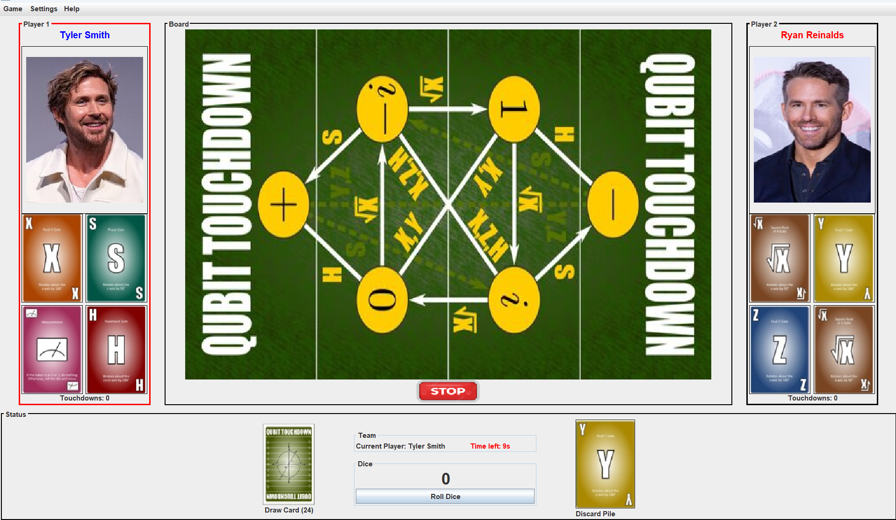

# Quantum Touchdown – Java Simulation Game

## Overview
Quantum Touchdown is an interactive Java-based game that simulates quantum computing concepts through a graphical user interface. The application demonstrates advanced software engineering principles including MVC architecture, client-server communication, and database integration.

## Features
- Interactive GUI built using Java Swing  
- MVC (Model-View-Controller) architecture  
- Client-server communication using sockets  
- Multi-threaded server handling multiple clients  
- User authentication system (login/signup)  
- Database integration using SQLite  
- Real-time gameplay and event handling  
- Support for running via JAR files and batch scripts  

## Technologies Used
- Java (Swing)  
- MVC Design Pattern  
- Socket Programming (Client-Server Model)  
- SQLite Database  
- Multi-threading  

## Project Structure
```
src/
 ├── qtouch/        (MVC components: Model, View, Controller)
 ├── qtouch/net/    (Client-server and database logic)
```

## How to Run

### Option 1: Using Batch File (Recommended)
Run the application using:
```
run.bat
```

### Option 2: Using JAR Files
Run the server:
```
java -jar QTouchserver.jar
```

Run the client:
```
java -jar QTouchclient.jar
```

## Key Concepts Demonstrated
- Object-Oriented Programming (OOP)  
- MVC Architecture  
- Client-Server Communication  
- Database Persistence  
- Event-Driven Programming  
## Screenshot

## Author
Heta Patel
